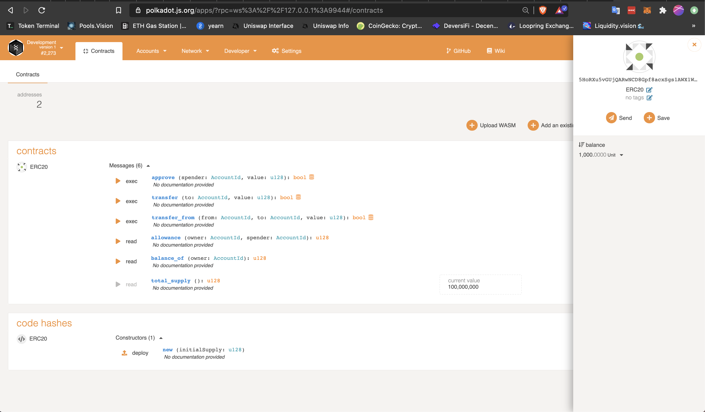
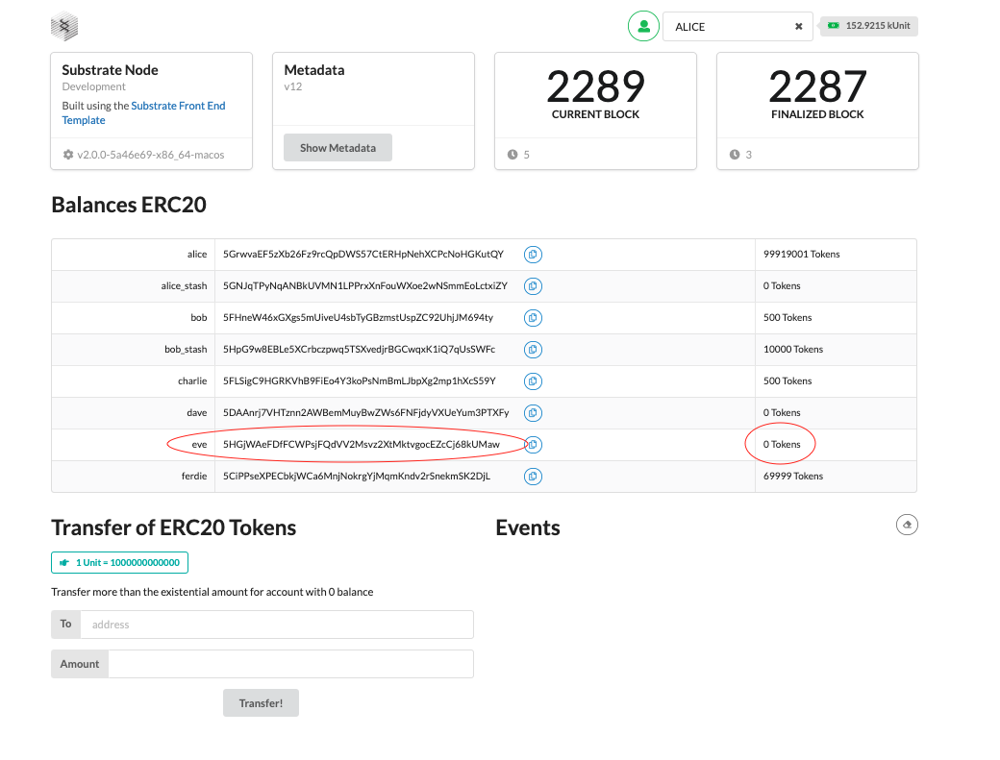
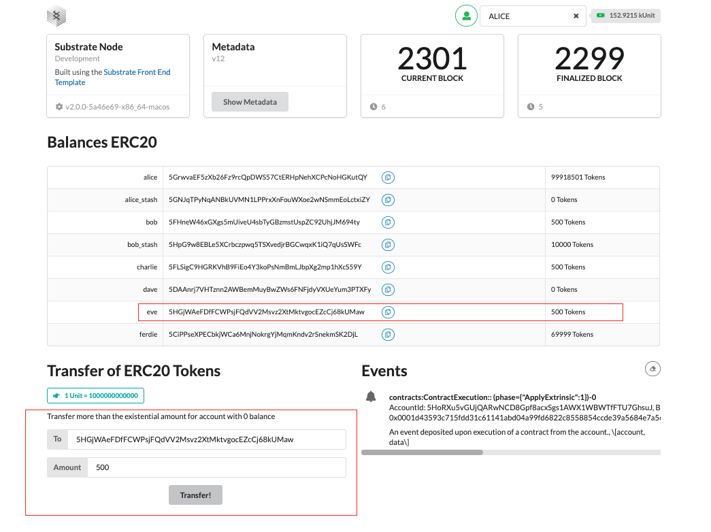

# [INTERMEDIATE CHALLENGE] Smart Contracts - Write An ERC-20 Smart Contract With Ink!

## Steps taken
- Clone and tweak the [substrate-node-template](https://github.com/substrate-developer-hub/substrate-node-template)
- Add the Contracts pallet to the node following the [tutorial](https://substrate.dev/docs/en/tutorials/add-contracts-pallet/) proposed in the task description
- Clone and tweak the [ERC20 smart contract from ink](https://github.com/alekscp/ink/tree/master/examples/erc20)
- Compile the smart contrat
- Deploy it to the local node using [polkadot.js.org](https://polkadot.js.org/apps/?rpc=ws%3A%2F%2F127.0.0.1%3A9944#/contracts)
- Clone and tweak the [substrate-front-end-template](https://github.com/substrate-developer-hub/substrate-front-end-template) in order to make a token transfer from the UI

